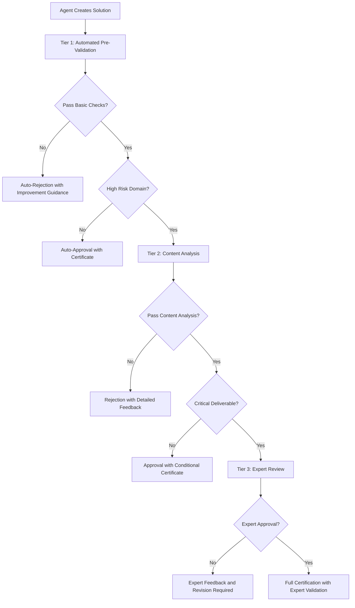

# Solution Compliance Validation Workflows
**Document Type:** ISO Solution Certification Framework  
**Version:** 1.0  
**Effective Date:** August 10, 2025  
**Review Date:** February 10, 2026  
**Owner:** Chief Compliance Officer and Solution Validation Team

## Solution Validation Overview

### Purpose and Scope
This framework enables automatic ISO compliance validation for all solutions created by the 51 AI agents, ensuring client deliverables meet ISO 27001, 42001, and 42005 standards while maintaining the lean approach focused on essential compliance requirements.

**Validation Coverage:**
- All client deliverables created using B2B AI agents
- Professional service outputs across legal, financial, healthcare, engineering, marketing, and design domains
- Integration with existing agent workflows for seamless compliance
- Automated certification with manual oversight for critical validations

---

## Validation Workflow Architecture

### Three-Tier Validation System

#### Tier 1: Automated Pre-Validation (Real-Time)
**Trigger:** Every agent output generation  
**Processing Time:** <2 seconds  
**Coverage:** Basic compliance checks and template application

**Automated Validation Checks:**
```yaml
pre_validation:
  security_checks:
    - data_classification_applied: true
    - access_controls_documented: true
    - privacy_protection_verified: true
  
  ai_governance_checks:
    - professional_boundaries_stated: true
    - human_oversight_required: true
    - ai_limitations_disclosed: true
  
  impact_assessment_checks:
    - stakeholder_considerations: true
    - risk_mitigation_included: true
    - professional_validation_required: true
```

#### Tier 2: Intelligent Content Analysis (30-60 seconds)
**Trigger:** Complex deliverables or high-risk domains  
**Processing Time:** 30-60 seconds  
**Coverage:** Deep content analysis and compliance mapping

**Content Analysis Framework:**
- Professional standard compliance verification
- Regulatory requirement mapping and validation
- Risk assessment integration and mitigation verification
- Stakeholder impact analysis and communication requirements

#### Tier 3: Human Expert Review (2-24 hours)
**Trigger:** Critical deliverables, regulatory submissions, or validation failures  
**Processing Time:** 2-24 hours based on complexity  
**Coverage:** Complete compliance validation with expert oversight

**Expert Review Process:**
- Domain expert validation of professional content accuracy
- Compliance officer review of regulatory adherence
- Risk manager assessment of mitigation completeness
- Client delivery approval with certification issuance

### Validation Decision Tree



---

## Agent-Specific Validation Workflows

### Legal Services Validation (5 agents)
**Agents:** Legal Advisor, Compliance Automation Specialist, AI Ethics Governance Specialist, Data Privacy Engineer, Enterprise Security Reviewer

**Validation Requirements:**
```yaml
legal_validation:
  compliance_checks:
    - legal_disclaimers_present: true
    - professional_consultation_required: true
    - jurisdiction_specific_compliance: true
    - attorney_validation_mandate: true
  
  content_validation:
    - legal_accuracy_review: tier_3_required
    - regulatory_compliance_mapping: automated
    - professional_liability_protection: mandatory
    - client_privilege_considerations: manual_review
  
  certification_level:
    - basic_guidance: tier_1_sufficient
    - complex_analysis: tier_2_required
    - regulatory_submissions: tier_3_mandatory
```

### Financial Services Validation (4 agents)
**Agents:** Finance Tracker, Pricing Packaging Strategist, Analytics Reporter, Trend Researcher

**Validation Requirements:**
```yaml
financial_validation:
  compliance_checks:
    - fiduciary_disclaimers_present: true
    - professional_advisor_validation: true
    - regulatory_disclosure_compliance: true
    - investment_advice_limitations: true
  
  content_validation:
    - financial_accuracy_review: tier_2_required
    - regulatory_compliance_check: automated
    - professional_boundary_enforcement: mandatory
    - client_suitability_assessment: conditional
  
  certification_level:
    - general_analysis: tier_1_sufficient
    - investment_recommendations: tier_2_required
    - regulatory_filings: tier_3_mandatory
```

### Healthcare Services Validation (2 agents)
**Agents:** (Healthcare domain agents if present in the 51-agent portfolio)

**Validation Requirements:**
```yaml
healthcare_validation:
  compliance_checks:
    - medical_disclaimers_present: true
    - licensed_professional_validation: true
    - hipaa_privacy_compliance: true
    - clinical_decision_limitations: true
  
  content_validation:
    - medical_accuracy_review: tier_3_required
    - regulatory_compliance_verification: mandatory
    - patient_safety_assessment: critical
    - professional_liability_protection: mandatory
```

### Technical Engineering Validation (15 agents)
**Validation Requirements:**
```yaml
technical_validation:
  compliance_checks:
    - technical_disclaimers_present: true
    - professional_engineer_validation: conditional
    - safety_compliance_documented: true
    - intellectual_property_protection: true
  
  content_validation:
    - technical_accuracy_review: tier_2_standard
    - safety_standard_compliance: automated
    - professional_boundary_maintenance: mandatory
    - client_implementation_guidance: required
```

### Marketing & Creative Services Validation (13 agents)
**Validation Requirements:**
```yaml
marketing_validation:
  compliance_checks:
    - creative_disclaimers_present: true
    - intellectual_property_clearance: true
    - advertising_standard_compliance: true
    - brand_guideline_adherence: conditional
  
  content_validation:
    - brand_safety_review: tier_1_sufficient
    - regulatory_advertising_compliance: automated
    - intellectual_property_validation: tier_2_required
    - client_approval_workflow: integrated
```

### Business Strategy Services Validation (12 agents)
**Validation Requirements:**
```yaml
strategy_validation:
  compliance_checks:
    - business_disclaimers_present: true
    - strategic_consulting_boundaries: true
    - competitive_intelligence_protection: true
    - client_confidentiality_maintained: true
  
  content_validation:
    - strategic_accuracy_assessment: tier_2_standard
    - competitive_analysis_validation: manual_review
    - professional_boundary_enforcement: mandatory
    - client_specific_customization: required
```

---

## Compliance Template Integration

### Dynamic Template Application
**Template Selection Logic:**
```yaml
template_selection:
  agent_type: 
    - maps to specific compliance template set
  client_domain:
    - applies industry-specific requirements
  deliverable_type:
    - determines validation depth and requirements
  risk_level:
    - escalates to appropriate validation tier
```

**Template Components:**
- Professional boundary statements
- Liability limitation clauses
- Regulatory compliance confirmations
- Professional validation requirements
- Client responsibility acknowledgments

### Compliance Certification Stamps

#### ISO 27001 Security Compliance Stamp
```
🛡️ ISO 27001 SECURITY VALIDATED
Information Security Management Compliant
- Data protection measures applied
- Access controls documented
- Privacy requirements met
- Security incident procedures included
Validation ID: [UNIQUE-ID] | Date: [DATE] | Level: [TIER]
```

#### ISO 42001 AI Governance Compliance Stamp
```
🤖 ISO 42001 AI GOVERNANCE VALIDATED  
AI Management System Compliant
- AI limitations clearly disclosed
- Professional oversight required
- Bias mitigation measures applied
- Stakeholder impact considered
Validation ID: [UNIQUE-ID] | Date: [DATE] | Level: [TIER]
```

#### ISO 42005 Impact Assessment Compliance Stamp
```
📊 ISO 42005 IMPACT ASSESSED
AI System Impact Assessment Compliant
- Individual impact evaluated
- Societal considerations addressed
- Environmental impact minimized
- Stakeholder engagement documented
Validation ID: [UNIQUE-ID] | Date: [DATE] | Level: [TIER]
```

---

## Automated Validation Engine

### Real-Time Validation API
```python
class ComplianceValidator:
    def __init__(self, agent_type, client_domain, deliverable_type):
        self.agent_type = agent_type
        self.client_domain = client_domain
        self.deliverable_type = deliverable_type
        self.risk_level = self.calculate_risk_level()
    
    def validate_solution(self, content):
        # Tier 1: Automated pre-validation
        if not self.tier1_validation(content):
            return self.rejection_response()
        
        # Risk-based tier escalation
        if self.risk_level >= 3:
            return self.tier2_validation(content)
        else:
            return self.auto_approval(content)
    
    def tier1_validation(self, content):
        checks = [
            self.check_professional_boundaries(content),
            self.check_liability_limitations(content),
            self.check_data_protection(content),
            self.check_ai_disclosures(content)
        ]
        return all(checks)
    
    def generate_certificate(self, validation_level, content):
        return {
            'iso_27001_stamp': self.generate_security_stamp(),
            'iso_42001_stamp': self.generate_ai_governance_stamp(),
            'iso_42005_stamp': self.generate_impact_stamp(),
            'validation_id': self.generate_unique_id(),
            'validation_level': validation_level,
            'expiry_date': self.calculate_expiry(),
            'audit_trail': self.create_audit_record(content)
        }
```

### Validation Performance Metrics
**Real-Time Monitoring:**
- Validation success rate by agent type
- Average validation processing time
- Client satisfaction with validated deliverables
- Expert review utilization and efficiency

**Quality Assurance:**
- False positive/negative validation rates
- Client feedback on validation accuracy
- Expert review consistency and quality
- Continuous improvement opportunity identification

---

## Client Integration Workflow

### Seamless Client Experience
**Pre-Delivery Validation:**
1. Agent generates solution using normal workflow
2. Automatic validation triggers based on content and risk
3. Compliance certification generated and attached
4. Client receives certified deliverable with validation stamps

**Client Validation Dashboard:**
```yaml
client_dashboard:
  validation_status:
    - real_time_progress_tracking
    - estimated_completion_time
    - validation_tier_explanation
  
  certification_details:
    - compliance_stamp_verification
    - validation_audit_trail
    - expert_reviewer_credentials
    - certificate_authenticity_check
  
  feedback_integration:
    - validation_quality_rating
    - improvement_suggestions
    - additional_validation_requests
    - expert_consultation_scheduling
```

### Client Self-Service Options
**Validation Level Selection:**
- Express validation (Tier 1 only) for routine deliverables
- Standard validation (Tier 1-2) for most professional work
- Premium validation (Tier 1-3) for critical or regulatory work

**Expert Review Request:**
- On-demand expert review for any deliverable
- Specific domain expert selection
- Rush processing for time-sensitive deliverables
- Post-delivery validation for additional assurance

---

## Continuous Improvement Framework

### Learning and Adaptation
**Validation Engine Evolution:**
- Machine learning integration for improved accuracy
- Client feedback integration for validation refinement
- Expert knowledge capture and automation
- Industry best practice integration and updates

**Process Optimization:**
- Validation time reduction through automation enhancement
- Expert review efficiency improvement
- Client experience optimization
- Cost reduction while maintaining quality

### Compliance Framework Updates
**Regular Framework Reviews:**
- Monthly validation performance analysis
- Quarterly process improvement implementation
- Annual framework comprehensive review
- Continuous regulatory requirement monitoring

---

**Document Control:**
- **Approved by:** Chief Compliance Officer, Chief AI Officer, Legal Counsel
- **Next Review:** February 10, 2026 (Quarterly updates based on performance)
- **Distribution:** All development teams, client success teams, compliance personnel
- **Related Documents:** Agent Compliance Templates, Audit Trail Procedures, Client Certification Guidelines